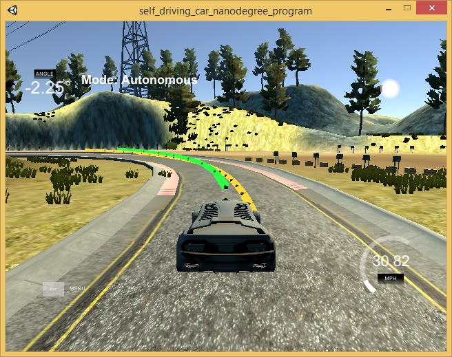

# Model Predictive Control Project

---

## Basic Build Instructions

1. Clone this repo.
2. Make a build directory: `mkdir build && cd build` 2b. Unzip /src/Eigen-3.3.zip
3. Compile: `cmake .. && make`
4. Run it: `./mpc`.

## Implementation

### The Model

#### state, actuators and update equations:

The equations of the kinematic vehicle model used here are:
1. x_[t+1] = x[t] + v[t] * cos(psi[t]) * dt
2. y_[t+1] = y[t] + v[t] * sin(psi[t]) * dt
3. psi_[t+1] = psi[t] + v[t] / Lf * delta[t] * dt
4. v_[t+1] = v[t] + a[t] * dt
5. cte[t+1] = f(x[t]) - y[t] + v[t] * sin(epsi[t]) * dt
6. epsi[t+1] = psi[t] - psides[t] + v[t] * delta[t] / Lf * dt
   
x and y are the position of the vehicle 
'psi' is the vehicle's orientation angle
v is the scalar velocity
'cte' is the cross-track error (or rather an approximation to it), which is the orthogonal distance between the reference trajectory and the vehicle position
'epsi' is the error between the vehicle's actual orientation angle psi and the orientation angle 'psides'
'dt' is the length of one time step in the model, 
'delta' is the input steering angle
'a' is the input acceleration
'Lf' is a constant describing the distance between the vehicle's center of gravity and its front wheels.

The proportinal weights used for the cost function are:

Reference State Cost:
CTE : 1000
EPSI : 20000
V : 1000
 
Actuator use cost, i.e. minimize the use of actuators for a smoother drive
DELTA: 500000
A : 1000
 
Actuator change rate cost, i.e. minimize the change in actuator use for a smoother drive
DELTA_DIFF : 40000
A_DIFF : 1
 
### Timestep Length and Elapsed Duration (N & dt)

Number of timesteps N = 10
Duration of one timestep dt = 0.5

When N is inceased it required more processing time in the solver. Hence N=10 was choosen
When the timestep is very small say 0.1 the totat distace the way points were calulated was ver small and hence optimal timestep of dt = 0.5 was choosen

### Polynomial Fitting and MPC Preprocessing

1. The waypoints are first converted to vehicle coordinates
Transforming from map coordinates to vehicle coordinates is the inverse operation of the transformation applied in the particle filter, where the vehicle's observations were transformed from vehicle coordinates to map coordinates. The order of this inverse transformation is translation first, rotation second. The inverse rotation matrix is:
      [ cos(psi) sin(psi)]
      [-sin(psi) cos(psi)]

2. The transformation is done as follows:
x_waypoint_vehicle = (x_waypoint_map - x_vehicle_map) * cos(psi) + (y_waypoint_map - y_vehicle_map) * sin(psi)
y_waypoint_vehicle = -(x_waypoint_map - x_vehicle_map) * sin(psi) + (y_waypoint_map - y_vehicle_map) * cos(psi)

3. The velocity converted from mph to meters per second.

4. Once the waypoints were transformed into vehicle coordinates, we'll fit a polynomial to them. This will be our reference trajectory from vehicle perspective.

5. Finally the IPOPT solver is executed to obtatin the constraints (steering angle and throttle) values.

### Model Predictive Control with Latency
A latency of 100 ms was considered here. 
Compensation for an expected latency of 100 ms was by predicting the car's state in 100 ms using the vehicle model.

This is implemented in lines 105 to 109 in main.cpp

## Simulation Results

The vehicle successfully drives multiple laps around the track. The prediction and way points to take a turn in simulator is shown below:

